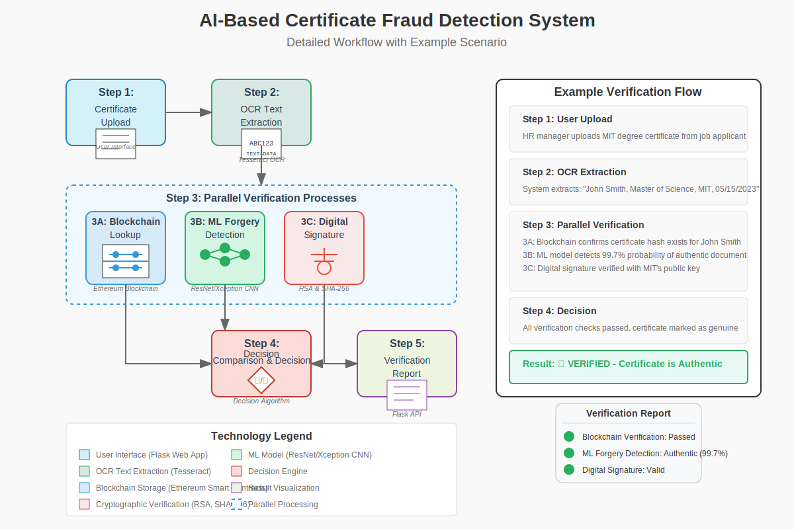

<p align="center">
  
</p>

<h1 align="center">🔗 Blockchain Certificate Verification System 🔗</h1>

<p align="center">
  <em>A secure, decentralized, and modern platform for issuing, managing, and verifying digital certificates using blockchain technology.</em>
</p>

<p align="center">
  
  
  
  
</p>

<p align="center">
  
</p>

---

## ✨ Core Features

| Feature                     | Description                                                                 | Icon |
| :-------------------------- | :-------------------------------------------------------------------------- | :--: |
| **Blockchain Security**     | Utilizes blockchain for tamper-proof certificate records.                   | 🔐   |
| **Smart Contract Automation** | Automates certificate lifecycle management via smart contracts.             | 🤖   |
| **Instant Verification**    | Provides immediate verification of certificate authenticity.                | ✅   |
| **AI Forgery Detection**    | Employs AI models to detect potential certificate forgeries.                | 🧠   |
| **Intuitive Dashboard**     | User-friendly interface for issuers and verifiers.                          | 📊   |
| **Responsive Design**       | Fully accessible on desktops, tablets, and mobile devices.                  | 📱   |
| **Secure Authentication**   | Robust user login and role-based access control.                            | 🔑   |

---

## 🚀 Tech Stack

<p align="center">
  
  
  
  
  
  
  
  
</p>

---

## 🛠️ Getting Started

### Prerequisites

- Python 3.10+
- Pip (Python Package Installer)
- Git
- (Optional) Docker

### Installation & Setup

1.  **Clone the Repository:**
    ```bash
    git clone https://github.com/yourusername/blockchain-certificate-verification.git
    cd blockchain-certificate-verification
    ```

2.  **Create a Virtual Environment (Recommended):**
    ```bash
    python -m venv venv
    # On Windows
    .\venv\Scripts\activate
    # On macOS/Linux
    source venv/bin/activate
    ```

3.  **Install Dependencies:**
    ```bash
    pip install -r requirements.txt
    ```

4.  **Initialize Database:**
    ```bash
    # Ensure database/database.py and the init_db function exist and are correctly referenced
    python -c "from database.database import init_db; init_db()"
    ```

5.  **Configure Environment Variables:**
    *   Create a `.env` file based on `.env.example` (if provided).
    *   Set necessary variables like `SECRET_KEY`, blockchain node URL, etc.

6.  **Run the Application:**
    ```bash
    flask run
    # Or using python directly if configured in app.py
    # python app.py
    ```

7.  **Access the Application:**
    Open your web browser and navigate to `http://127.0.0.1:5000` (or the configured port).

---

## 🧪 Running Tests

Ensure the integrity of the application by running the test suite:

```bash
# Make sure you have pytest installed: pip install pytest
pytest
